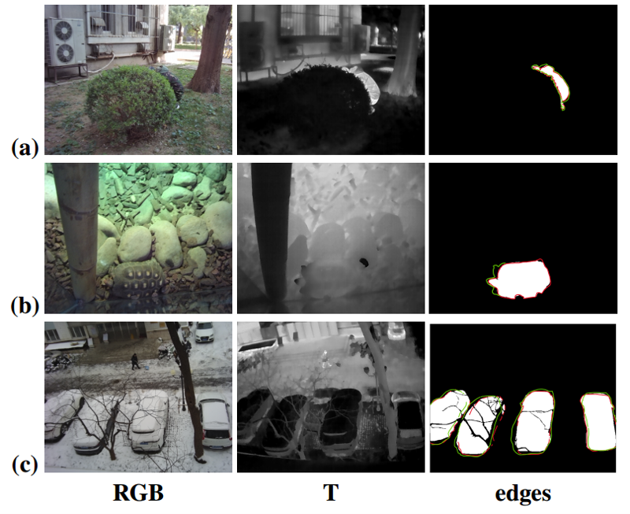
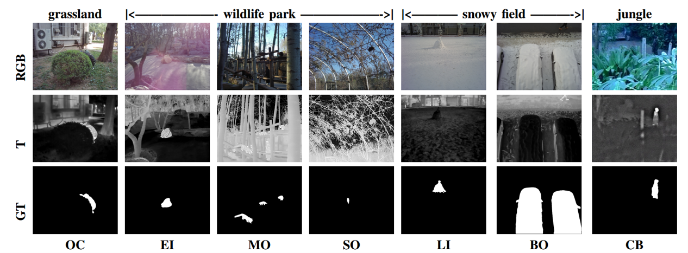
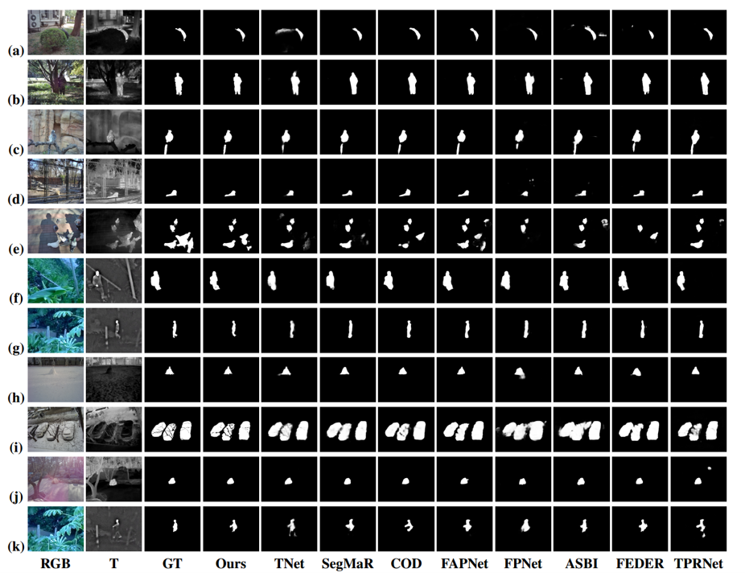

# <p align=center>`Band-mixed Edge-Aware Interaction Learning for RGB-T Camouflaged Object Detection `</p>
> **Authors:**
Ruiheng Zhang, Kaizheng Chen, Lu Li, Yunqiu Xu, Weitao Song, Lixin Xu and Zheng Lin

## Introduction
In this paper, we consider the problem of Band-mixed Edge-Aware Interaction Learning for RGB-T Camouflaged Object Detection (RGB-T COD), a new task that aims to segment camouflaged targets through the combined use of both RGB and thermal infrared bands. 
  
<p align="center">
     <br />
    <em> 
Fig. 1:Examples of camouflaged objects: Example (a) shows a case where the
objects are camouflaged in an RGB image, example (b) shows a case where
the objects are camouflaged in a thermal image, and example (c) shows a
case where the objects are camouflaged in both RGB and thermal images.
The third column shows different edges: the red lines show the RGB edge
and the green lines show the thermal edge.
    </em>
</p>

## Environment setup
``` 
conda env create -f environment.yml
conda activate BEI_Net
```

## Get Start
**1. Dataset.**
<p align="center">
     <br />
    <em>
      Fig. 2. Visualization of thermal-visible images in our TVCO1K dataset covering 7 challenges.
    </em>
</p>
 
**2. Test.**
- The pre-trained [BEI-Net.pth](https://pan.quark.cn/s/b755896fc68b) checkpoint file.
- Run ```python test.py``` to evaluate the performance of BEI-Net.

**3. RGB-T COD Benchmark Results.**
<p align="center">
    <em>
        Fig. 3:Visual comparisons of different SOTA methods about COD and SOD under various challenges, where each row indicates one input image. This figure shows that our proposed method consistently generates camouflaged maps close to the Ground Truth (GT). Zoom in for details.
    </em>
     <br />
</p>


